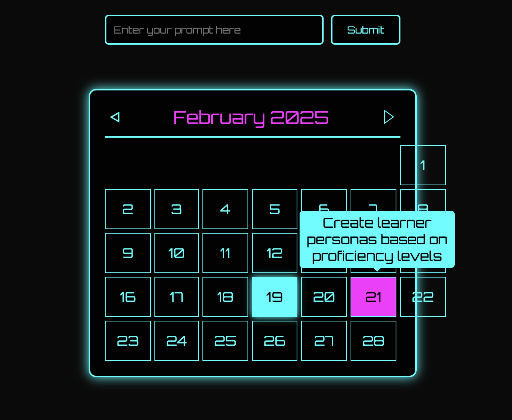
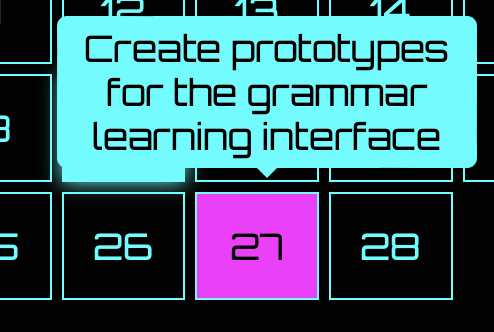

# cyberpunk_calendar
Cyberpunk_Calendar
# 🌟 Cyberpunk Calendar AI Project

An interactive, AI-powered calendar application with a cyberpunk aesthetic that generates personalized schedules based on user prompts.



## 🔮 System Architecture

```ascii
+----------------------------------+
|        User Interface            |
|  +--------------------------+    |
|  |     Calendar Display     |    |
|  |  +------------------+    |    |
|  |  |   Month View     |    |    |
|  |  |   • Tasks        |    |    |
|  |  |   • Dates        |    |    |
|  |  |   • Tooltips     |    |    |
|  |  +------------------+    |    |
|  |                          |    |
|  |  +------------------+    |    |
|  |  |   AI Prompt      |    |    |
|  |  |   Input Field    |    |    |
|  |  +------------------+    |    |
|  +--------------------------+    |
+----------------------------------+
              ↕
+----------------------------------+
|      Cloudflare Functions        |
|  +--------------------------+    |
|  |    AI Processing        |    |
|  |  • Task Generation      |    |
|  |  • Schedule Creation    |    |
|  |  • Error Handling      |    |
|  +--------------------------+    |
+----------------------------------+
              ↕
+----------------------------------+
|         Data Storage             |
|  +--------------------------+    |
|  |   JSON Data Format      |    |
|  |  • Dates               |    |
|  |  • Tasks              |    |
|  |  • Day Information    |    |
|  +--------------------------+    |
+----------------------------------+
```

## 🚀 Features

- **Interactive Calendar Display**: Navigate through months with cyberpunk-styled interface
- **AI-Powered Scheduling**: Generate custom schedules based on user prompts
- **Real-time Updates**: Instantly view AI-generated tasks on the calendar
- **Fallback System**: Default schedule available if AI service is unavailable
- **Responsive Design**: Works on both desktop and mobile devices
- **Cyberpunk Aesthetics**: Neon colors and futuristic design elements

## 🛠️ Technical Stack

- **Frontend**: HTML5, CSS3, JavaScript
- **Backend**: Cloudflare Workers
- **AI Integration**: Cloudflare AI with Llama-2 Model
- **Data Format**: JSON
- **Styling**: Custom CSS with Orbitron font

## 🔧 How It Works

1. **User Input**
   - User enters a goal or project description in the AI prompt field
   - Submits request for schedule generation

2. **AI Processing**
   - Request is sent to Cloudflare Worker
   - AI model generates a structured schedule
   - Response is formatted as JSON data

3. **Display**
   - Calendar updates with new schedule
   - Tasks appear as tooltips on dates
   - Interactive navigation between months

4. **Fallback System**
   - Default schedule loads if AI service fails
   - Ensures continuous functionality

## 📦 Project Structure

```
cyberpunk_calendar/
├── index.html          # Main HTML file
├── styles.css          # Cyberpunk styling
├── script.js           # Calendar logic & AI integration
├── functions/
│   ├── ai.js          # Cloudflare Worker AI function
│   └── data.json      # Fallback schedule data
└── README.md          # Documentation
```

## 🎨 Design Elements

- **Color Scheme**:
  - Primary: #0ff (Cyan)
  - Secondary: #ff00ff (Magenta)
  - Background: #0a0a0a (Deep Black)
- **Font**: Orbitron (Google Fonts)
- **Interactive Elements**: Hover effects, tooltips
- **Loading Screen**: Cyberpunk-themed waiting animation

## 🚀 Getting Started

1. Clone the repository
2. Configure Cloudflare Worker with AI bindings
3. Update the Worker URL in `script.js`
4. Deploy to your hosting platform

## 🔐 Configuration

```javascript

const WORKER_URL = "https://your-worker-url.workers.dev";


export async function onRequest(context) {
}
```

## 📸 Screenshots


*Main calendar interface with AI prompt*


*Task display with cyberpunk tooltips*

## 🤝 Contributing

Feel free to submit issues and enhancement requests!

## 📜 License

MIT License - feel free to use and modify!

---

Created with 💻 and neon lights ✨
